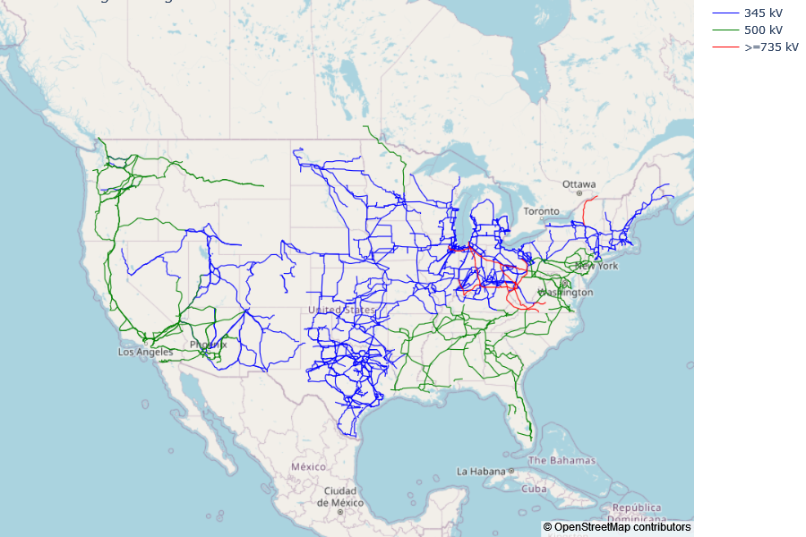
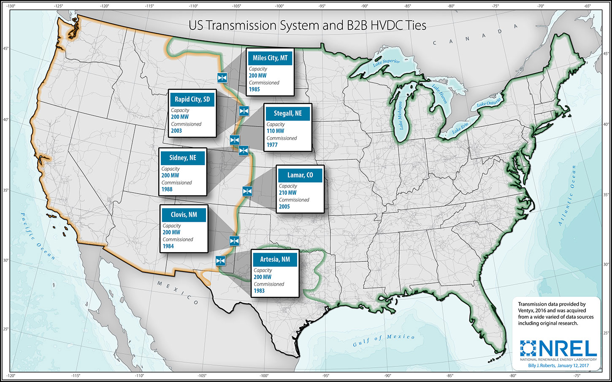
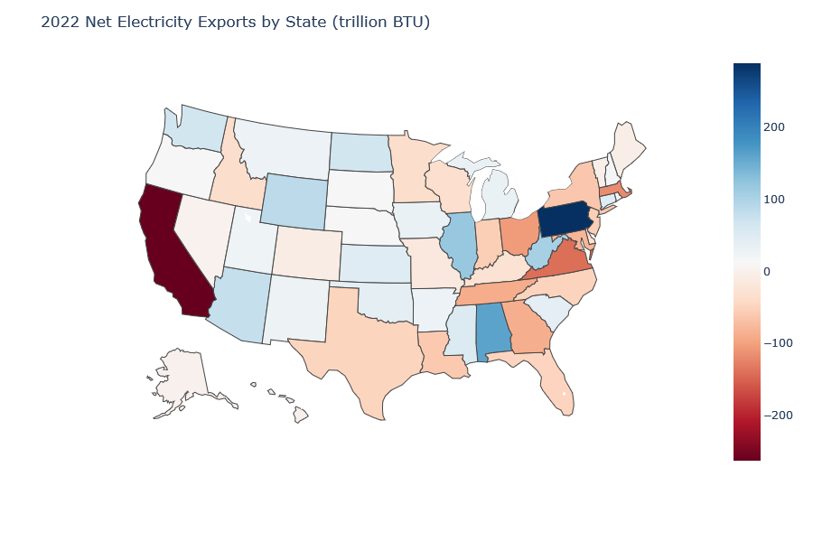
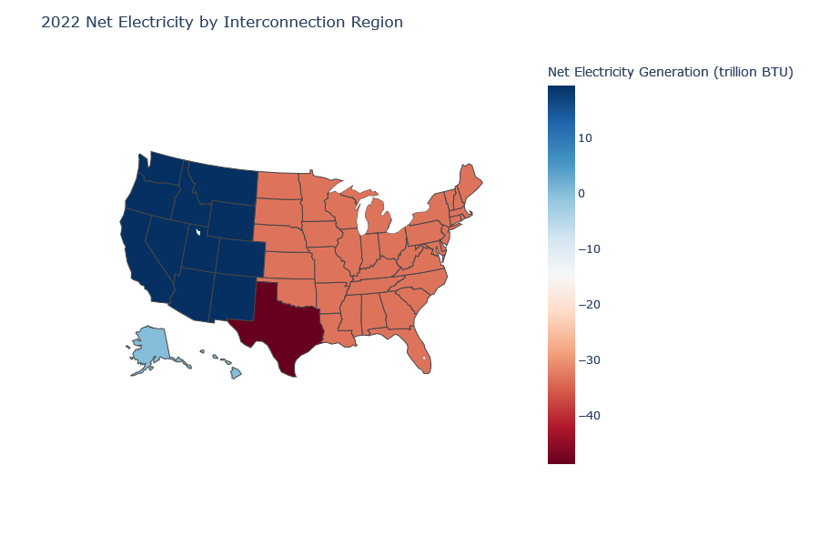
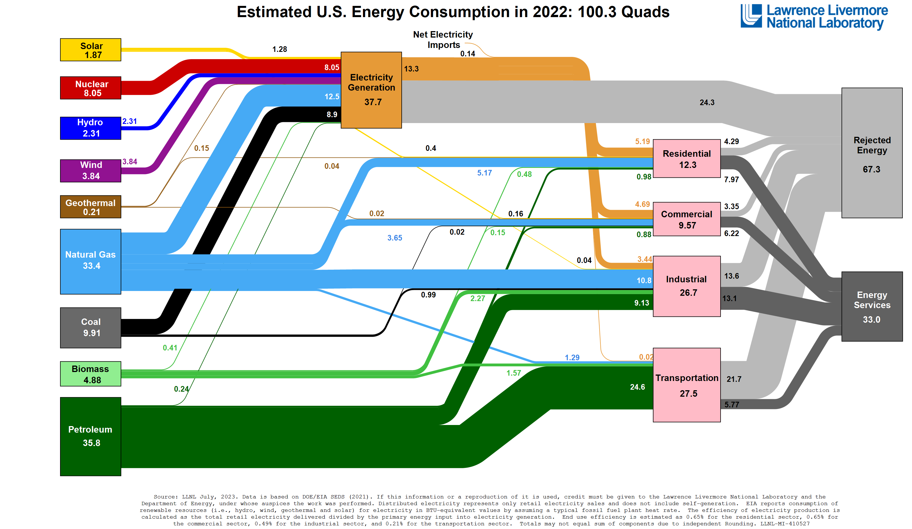
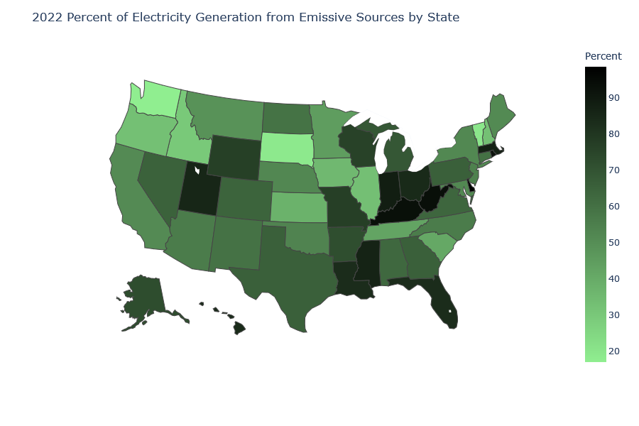
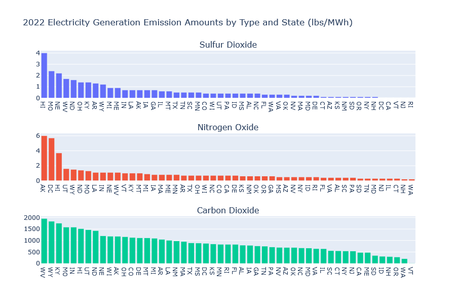
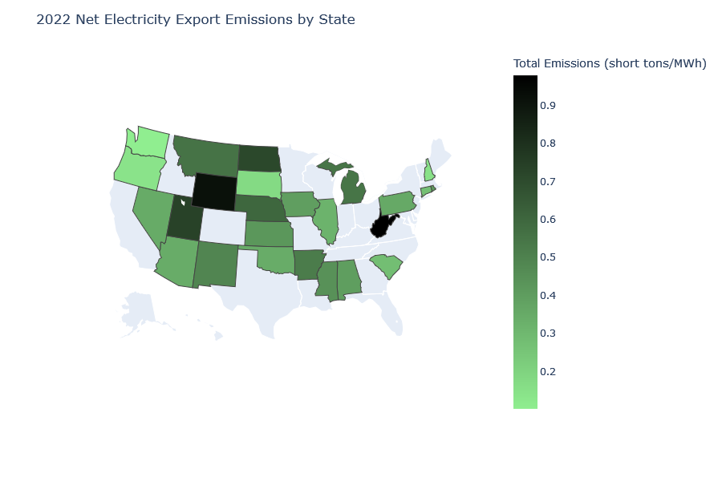
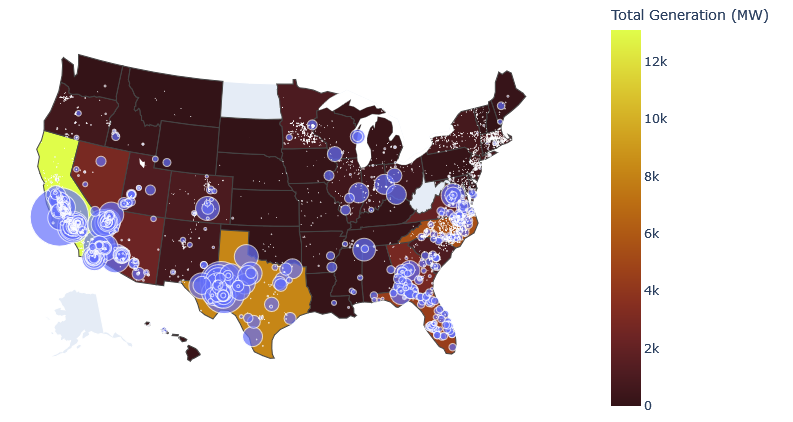
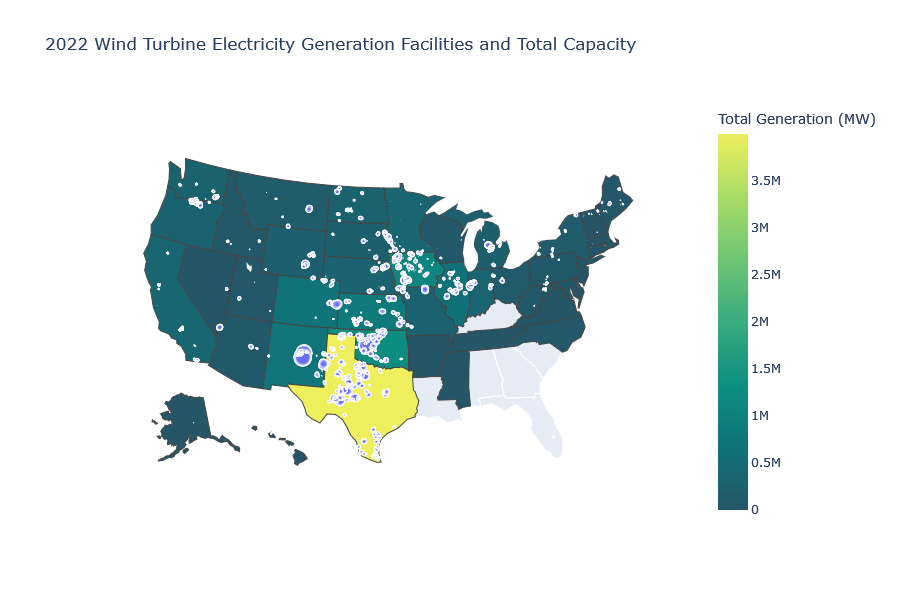

# bigwires

<h1>Why the BIG WIRES Act?  An Exploratory Data Analysis</h1>
<h2>Eric Lagally</h2>
<h2>ericlagally@gmail.com</h2>
<h3>January 2024</h3>

Data are available at:  <https://drive.google.com/file/d/10J0V3-jbPkZqGTjlZdLw0azH4M46z73S/view?usp=sharing>.  Download and unzip into a `/data` folder that is a subfolder of the folder housing the code and this file.  

<h2>Introduction:</h2>
The BIG WIRES Act (H.R. 5551, S. 2827) was introduced in Congress in late 2023.  It is a bill that proposes to streamline the permitting process for the development of large, high-voltage electrical transmission lines in the United States.  The introduction to the text of the Act reads:
> Congress finds that—

> (1) interregional electric transmission is foundational to a modern grid and a growing economy based on affordable and abundant energy;

> (2) in recent decades, the interregional electric grid infrastructure of North America, and of the United States in particular, has stagnated;

> (3) since 2014, the total capacity of planned or newly constructed large-scale interregional transmission in North America has amounted to less than 1⁄3 that of South America, 1⁄6 that of Europe, and 1⁄30 that of China;

> (4) such a shortage of interregional transmission threatens the reliability of the electric grid of the United States and its resiliency to extreme weather events and cyber and physical attacks while artificially inflating energy prices for the people of the United States;

> (5) the damages resulting from that interregional transmission shortfall have been borne across the United States, in part during extreme weather events, including the 2022 freeze affecting the majority of the United States, the 2020 and 2022 heat waves in California, the 2019 heat wave and 2021 freeze in Texas, the 2018 cyclone on the East Coast, and the 2014 polar vortex in the Northeast and Midwest, and those extreme weather events collectively cost the people of the United States hundreds of billions of dollars;

> (6) new interregional transmission, and transfer capability achieved by means of other technologies and grid-operational practices, represents a unique opportunity to fortify the critical energy infrastructure of the United States while lowering the cost of living for families;

> (7) studies of interregional transmission routinely find benefit-cost ratios as high as 2.5, in line with real-world experience;

> (8) by relieving grid congestion and promoting more efficient grid planning and operation, new interregional transmission presents an all-of-the-above opportunity for the full energy-generating portfolio of renewable, fossil, and nuclear resources of the United States; and

> (9) interregional transmission represents a 2-way value proposition, with secure careers for workers in energy communities and competitively sourced, low-cost, reliable energy for industrial, commercial, and residential energy customers nationwide.

Points #4 and #8 above caught my eye because they speak to an electrical grid that is potentially unreliable and that does not fully leverage the clean-energy capacity in the United States.  Specifically I wondered: 

1. What is the current state of high-voltage electrical transmission in the U.S.?
2. What are the regional and national needs for electrical transmission in the U.S.?
3. What other factors (i.e., placement of clean electricity generation facilties and carbon-equivalent emmissions from other electricity generation)  motivate the construction of new high-voltage transmission lines?

Using data from the U.S. Energy Information Administraton (EIA) and other sources, I sought to address these questions using figures, images, and modeling in Python, the full code for which is found in the cells below.  Good analysis is transparent and builds on previous learning.  For that reason, I encourage your careful review to determine whether my analysis is correct and, if so, to build on it to answer other more advanced questions you may have.  The GitHub repository contains a Jupyter notebook with my code, copies of the

<h3>Question 1</h3>

Question #1 focuses on the current state of high-voltage electrical transmission lines in the U.S.  How many are there?  What are their capacities?  Once we know that information, we can analyze about how this compares to the current need, which is Question #2.  

I began by reviewing a primer on the organization of electricity transmission in the United States.[2]  To begin the analysis of existing electricity transmission infrastructure, I loaded a GeoJSON file of all U.S. electrical transmission lines downloaded from the ArcGIS Hub.[3]  I filtered the file to include only those high-voltage transmission lines >345 kV, which number 71,085.

Next I plot the high-voltage transmission lines to show high-level information:

As I expected, there are many high-voltage transmission lines connecting the states within the eastern and western halves of the US continent, which form the Eastern Interconnection and Western Interconnection regions. However, relatively few high-voltage transmission lines connect these two regions (connections to the Texas Interconnection Region fare better). This is understandable for two reasons. First, transmission lines are run at high voltages to minimize the voltage loss as much as possible over long distances, but the longer the distance the greater the loss.  Therefore one line connecting the western-most states with the eastern-most states is infeasible.  Second, previous attempts to connect the Interconnections in the second half of the 20th century were disconnected because they were not stable.  This was due to frequency fluctuations inherent to mismatches between power generation and power usage in AC systems (see [4]).  Current existing connections between the eastern and western halves of the country number seven DC ties totaling <b>1.32 GW</b> total. Existing high-voltage DC (HVDC) ties are shown below:

 

<h3>Question 2</h3>

Given the current state of electrical transmission in the United States, I next investigated how this compares to the amount of electricity generated at a state level.  

As the image shows, some states exported electricity in 2022 while adjacent states imported electricity (examples are Washington and Idaho, Alabama and Georgia, and Pennsylvania and Ohio).  These electricity exports and imports are supported by existing transmission lines to exchange electricity between adjacent states.  However, there are other states (like California) that import a tremendous amount of electricity that is not balanced by electricity exports from adjacent states.  This speaks to the need for even longer-distance transmission lines that connect distant states and/or DC ties that enhance connectivity between Interconnection regions.  I next investigated the net electricity balance between the three major interconnection regions:

The above choropleth demonstrates that each interconnection region has unique needs.  The Western Interconnection region, as a whole, is a net exporter of electricity.  However, the Eastern and Texas interconnection regions are net importers of electricity, and this is not compensated for by the exports from the Western Interconnection region.  To compare these data to the power capacity of existing HVDC ties, it was necesary to convert from BTU (a unit of energy) to GW (a unit of power).  Converting the BTU values to GW requires dividing the annual total by 8760 to yield BTU/hour, then coverting this to GW (1 BTU/hr = 0.29307107 W).  Doing so reveals that the Eastern Interconnection region requires a net import of <b>1.11 GW</b> while the Texas interconnection region requires a net import of <b>1.63 GW</b>.  Comparing to the DC tie capacity above of 1.32 GW, it is clear that these ties are near or at the limit of their capacity. There are slight inaccuracies here because the interconnection regions do not occur strictly along state lines.  A county-level analysis would provide more accurate outcomes.

To the point above that the net imports from certain interconnection regions are not fully compensated by other regions, we also see that the United States must be a net importer of electricity from Canada and Mexico. As shown in the Lawrence Livermore National Laboratory Sankey chart below, in 2022 the United States imported 0.14 quads (quadrillion BTU), or 1.4 x 1014 BTU, of electricity.[5] While that is a small percentage of the total electricity used in the United States in that year, it is nonetheless a tremendous amount of energy.

 

<h3>Question 3</h3>

Understanding the present condition of electricity generation at the state and regional levels and the limitations on transfer of this energy, I explored other factors that motivate how and where electricity transmission may be required.  In particular, as the United States transitions to a more clean-energy future we expect that electrical demands will increase compared to current state due to increased use of electric cars, furnaces, heat pumps, water heaters, and so on.  Further, the carbon-equivalent emissions profiles of the electricity generation become important to consider.  Generating more electricity to meet future demand with high carbon-emission sources will not effectively address the rate of climate change.  

I therefore explored the carbon-equivalent emissions of the electricity generation at the state and regional levels, and compared these to the sources of new carbon-neutral electricity generation in the form of solar electricity stations, which are quickly increasing in capacity. I began with the electricity generation data from the state profiles available on the EIA website and collated them. I next grouped categories of electricity generation into "Emissive" and "Non-emissive" to get a sense of which states have the highest and lowest proportions of electricity generation from carbon-neutral sources.  Emissive categories were Coal, Natural gas, Other, Other biomass, Petroleum, and Wood.  Non-emissive categories were Hydroelectric, Nuclear, Solar, and Wind. Plotting the relative fractions of emissive generation methods by state yielded:

The top five and bottom five states with the most emissive electricity generation in 2022 were:

Top 5 Least Emissive Electricity Generation States:
|    State     |    Percent Emissive Generation |
|:------------:|:------------------------------:|
|   WA         |         16.9                   |
|   SD         |         18.7                   |
|   VT         |         19.6                   |
|   ID         |         29.8                   |
|   OR         |         32.7                   |

Top 5 Most Emissive Electricity Generation States:
|    State     |    Percent Emissive Generation |
|:------------:|:------------------------------:|
|   DE         |         98.7                   |
|   WV         |         93.6                   |
|   KY         |         93.4                   |
|   RI         |         92.6                   |
|   IN         |         88.3                   |

As well as the percentage of electricity generating emissions in each state, the rate of emissions by type is important because not all emissions have the same effect on the environment. Estimates are available for sulfur dioxide (contributes to formation of acid rain), nitrogen oxide (a general term for various nitrogen-oxygen compounds of which NO2 is a greenhouse gas), and carbon dioxide (a well-known greenhouse gas).  Methane emissions are not captured in the EIA data because the bulk of these emissions are categorized as oil and gas production rather than consumption for electricity generation. For more information on this topic, I recommend a recent study using satellite data to map methane emissions.[6]

These data illustrate a wide range of climate-impact footprints for electricity generation and export. Of note, four of five least-emissive states in their electricity generation are all in the Western Interconnection region, while all of the five most-emissive states are in the Eastern Interconnection region.  What would be ideal is to have the ability to strengthen transfer of non-emissive electricity between states both within and between interconnection regions.  Examples include between Washington, Oregon, and Utah as well as between Illinois and Wisconsin, Indiana, and Missouri. The above analysis also demonstrates those places where non-emissive electricity generation needs to increase.  

I next calculated the total emissions rate (sulfur dioxide, nitrogen oxides, and carbon dioxide) for those states that exported electricity in 2022:

The states that exported low-emissions electricity in 2022 primarily relied on hydroelectric, solar, and wind power to do so. Recent years have seen a rapid increase in the construction of solar photovoltaic and wind electricity generation in the United States, at both the utility and state levels. Public datasets of the major solar installations and wind farms are available from the USGS. To analyze the locations of these installations compared to the need for non-emissive electricity by state, I first loaded the datasets:

Each data set contains the state in which the facility is located, enabling a visualization of the total wind and solar capacity by state as well as the individual facility locations and capacities:

 

<h2>Conclusions</h2>

This analysis illustrated several major findings:
<ol>
    <li>The existing network of high-voltage electrical transmission lines within the United States is primarily among nearby states.</li>
    <li>Interconnections between regions in the United States is achieved through high-voltage DC ties, which are at or nearly at capacity.</li>
    <li>There are some states that export electricity and others that import electricity but these states are not always adjacent.  Some states import a large fraction of their electricity, which is not fully supplied by neighboring states.</li>
    <li>There is a wide variety of types of electricity generation in use and different states present widely-varying emissions profiles for the electricity they generate.</li>
    <li>Among the states that exported electricity in 2022, there are widely varying profiles of emissions resulting from that electricity generation.  The electricity from exporting states that is lowest in emissions is scattered throughout the country.</li>
    <li>The use of solar and wind for electricity generation is not evenly distributed across the states, and opportunties exist to enhance the transmission of electricity from those states producing it to adjacent states, especially those with high-emissions electricity generation and/or that are net importers of electricity.</li>
</ol>

These findings, when taken together, paint a picture of an existing need for increased electricity transmission capacity, especially to support future electricity demand due to clean energy efforts through other bills, like the Inflation Reduction Act.  Although I did not study it here, the rate of solar electricity generation is increasing [7], which is expected to increase this transmission need in the future. This analysis does not indicate whether the BIG WIRES Act is the optimal approach for such capacity improvement, but does support Points #4 and #8 in the introduction.

<h2>References</h2>

[1] U.S. Energy Information Administration, state search:  <https://www.eia.gov/state/search/?sid=US>

[2] <https://www.ncsl.org/environment-and-natural-resources/electric-transmission-planning-a-primer-for-state-legislatures>

[3] <https://hub.arcgis.com/datasets/fedmaps::u-s-electric-power-transmission-lines/about>

[4] <https://ieeexplore.ieee.org/stamp/stamp.jsp?arnumber=8594689>, Section III

[5] <https://flowcharts.llnl.gov/commodities/energy>

[6] <https://www.science.org/doi/10.1126/science.abj4351>

[7] <https://electrek.co/2023/09/29/us-solar-is-booming-heres-the-newly-released-data/>